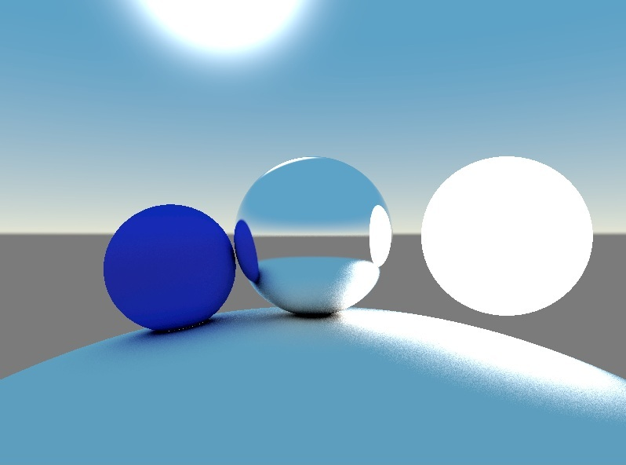

# Raytracer Test

A raytracer built with Vulkan and C++20 modules that supports realtime compute-shader-based raytracing with multi-bounce and multi-ray per pixel.

You can control the camera using `WASD` / `Arrow` keys, and the mouse. `Tab` will toggle input. `Escape` will quit the application.



## Roadmap

 - [ ] Load models from glTF files
 - [ ] Depth of Field
 - [ ] Controls GUI
 - [ ] Textures
   - [ ] Texture Infrastructure
   - [ ] Albedo Texture
   - [ ] Normal Texture
   - [ ] Metallic Texture
   - [ ] Roughness Texture
 - [ ] Importance Sampling
 - [ ] Other methods of reducing noise

## How to Build

If you'd like to build without cmake, use [this guide.](BUILDING_WITHOUT_CMAKE.md)

### Build Shaders

When building using cmake, you can run the `BuildShaders` target.

Alternatively, you can also just run the following commands with `...` replaced with relevant paths and `x.x.x.x` replaced with relevant version:
```
.../VulkanSDK/x.x.x.x/Bin/glslc.exe -fshader-stage=vertex Fullscreen.vert.glsl -o Fullscreen.vert.spv
.../VulkanSDK/x.x.x.x/Bin/glslc.exe -fshader-stage=fragment Fullscreen.frag.glsl -o Fullscreen.frag.spv
.../VulkanSDK/x.x.x.x/Bin/glslc.exe -fshader-stage=compute Raytracing.comp.glsl -o Raytracing.comp.spv
```

### Build Project

 1. Download and install Vulkan.
 2. Run CMake in the root directory of this project, where CMakeLists.txt is.
 3. Open the Solution.
 4. Open the properties for VulkanRaytracer. Set `C/C++ > Code Generation > Floating Point Model` to be blank.
 5. Build glfw, and then build VulkanRaytracer


## Libraries and APIs used

 * [GLFW](https://www.glfw.org/)
 * [GLM](https://github.com/g-truc/glm)
 * [STB Image](https://github.com/nothings/stb/blob/master/stb_image.h)
 * [Vulkan](https://vulkan.lunarg.com/)

## References and Thanks

### PBR and Raytracing
 * [LearnOpengl.com's PBR Theory Article](https://learnopengl.com/PBR/Theory) by Joey de Vries
 * [Ray Tracing in One Weekend](https://raytracing.github.io/) by Peter Shirley
 * [Physically Based Rendering: From Theory To Implementation](https://pbr-book.org/) by Matt Pharr, Wenzel Jakob, and Greg Humphreys
 * [Sebastian Lague's YouTube Video](https://www.youtube.com/watch?v=Qz0KTGYJtUk) which provides an excellent summary over the concept of Raytracing

### Vulkan
 * [Vulkan-Tutorial.com](https://vulkan-tutorial.com) by Alexander Overvoorde and Sascha Willems
 * [This Vulkan Github Repository](https://github.com/SaschaWillems/Vulkan) by Sascha Willems
