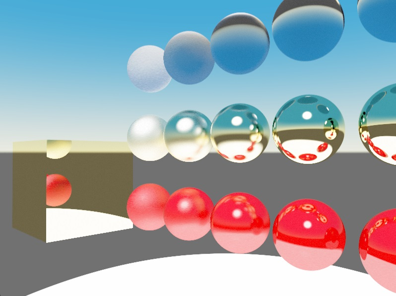

# Raytracer Test

A raytracer built with Vulkan and C++20 modules that supports realtime compute-shader-based raytracing with multi-bounce and multi-ray per pixel. We only support spheres for the time being.



## Roadmap

 * Resizing the viewport
 * Move the camera using glfw input
 * Support Cook-Torrence BRDF
 * Adding support for triangles
 * Culling objects by AABB
 * Two-Coat Materials
 * Depth of Field
 * Textures
   * Texture Infrastructure
   * Albedo Texture
   * Normal Texture
   * Metallic Texture
   * Roughness Texture
 * Other methods of denoise

## How to Build

### Libraries and APIs used

 * [GLFW](https://www.glfw.org/)
 * [GLM](https://github.com/g-truc/glm)
 * [STB Image](https://github.com/nothings/stb/blob/master/stb_image.h)
 * [Vulkan](https://vulkan.lunarg.com/)

### Build Shaders

Run the following commands with `...` replaced with relevant paths and `x.x.x.x` replaced with relevant version:
```
...\VulkanSDK/x.x.x.x/Bin/glslc.exe -fshader-stage=vertex ParticleSystem.vert.glsl -o vert.spv
...\VulkanSDK/x.x.x.x/Bin/glslc.exe -fshader-stage=fragment ParticleSystem.frag.glsl -o frag.spv
...\VulkanSDK/x.x.x.x/Bin/glslc.exe -fshader-stage=compute ParticleSystem.comp.glsl -o comp.spv
```

### Build Project
 1. Download the libraries specified above. 
 2. Create a project that uses c++20 for modules.
 3. Add `Libraries/bin` folder, GLFW installation's relevant `lib` folder, and Vulkan installation's `Lib` folder to library directories.
 4. Add `vulkan-1.lib;glfw3.lib` to libraries.
 5. Add `Libraries/include`, GLFW installation's `include` folder, GLM's `glm` directory, and `stb_image.h` your Vulkan installation's `Include` directory to include directories.
 6. Add `GLFW_INCLUDE_VULKAN` to preprocessor definitions.
 7. Build and run the project

## References and Thanks

### PBR and Raytracing
 * [LearnOpengl.com's PBR Theory Article](https://learnopengl.com/PBR/Theory) by Joey de Vries
 * [Ray Tracing in One Weekend](https://raytracing.github.io/) by Peter Shirley
 * [Physically Based Rendering: From Theory To Implementation](https://pbr-book.org/) by Matt Pharr, Wenzel Jakob, and Greg Humphreys
 * [Sebastian Lague's YouTube Video](https://www.youtube.com/watch?v=Qz0KTGYJtUk) which provides an excellent summary over the concept of Raytracing

### Vulkan
 * [Vulkan-Tutorial.com](https://vulkan-tutorial.com) by Alexander Overvoorde and Sascha Willems
 * [This Vulkan Github Repository](https://github.com/SaschaWillems/Vulkan) by Sascha Willems
